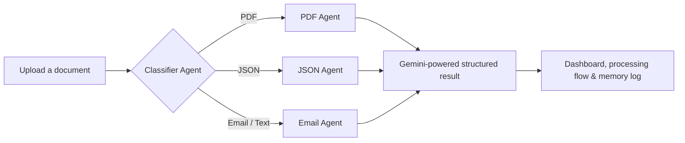

<div align="center">

# Classifier Agent

### An AI-powered, multi-agent workspace for turning unstructured documents into actionable data.

[](https://classifier-agent.vercel.app/)
[](https://react.dev/)
[](https://ai.google.dev/)
[](https://vite.dev/)

[Explore the live app](https://classifier-agent.vercel.app/) · [Report a bug](https://github.com/Unnati061/classifier-agent/issues) · [Request a feature](https://github.com/Unnati061/classifier-agent/issues)

</div>

.png)

## Why Classifier Agent?

Documents arrive in every shape: invoices in PDFs, structured payloads in JSON, and time-sensitive requests in email. Classifier Agent provides one place to upload them, understand their purpose, route them to the right specialist, and review the result in a clean audit trail.

It is designed as a practical showcase of an **agent-routing workflow**: a classifier decides what it is looking at, a specialist agent extracts useful information, and the dashboard makes every step visible.

## Core capabilities

| Capability | What happens |
| --- | --- |
| **Smart routing** | Automatically identifies PDF, JSON, and email uploads and assigns the appropriate specialist agent. |
| **Intent detection** | Identifies business context such as invoices, RFQs, complaints, contracts, or general requests. |
| **Structured extraction** | Converts mixed-format input into a consistent JSON response suitable for downstream systems. |
| **PDF intelligence** | Sends PDFs to Gemini as native document input for summarisation, document-type detection, metadata, and key-data extraction. |
| **Email triage** | Extracts sender, subject, urgency, entities, and action items from `.eml` or text email files. |
| **Transparent workflow** | Displays agent status, the processing route, output data, and session memory logs. |

## How it works



```text
React client
    └── POST /api/process (Vercel serverless function)
            └── Gemini Generate Content API
                    └── Normalised JSON response
                            └── Dashboard visualisation
```

The Gemini credential remains on the server. It is never sent to the browser.

## Example output

Upload an email such as:

```text
From: client@example.com
Subject: Urgent invoice payment request

Please review invoice INV-001 and arrange payment today. This is urgent.
```

The Email Agent returns a structured record similar to:

```json
{
  "agent": "Email Agent",
  "summary": "Client requests urgent payment for invoice INV-001.",
  "sender": "client@example.com",
  "subject": "Urgent invoice payment request",
  "intent": "Invoice payment request",
  "urgency": "High",
  "keyEntities": ["INV-001"],
  "actionItems": ["Review the invoice and arrange payment today."]
}
```

## Built with

| Layer | Technology |
| --- | --- |
| Frontend | React, TypeScript, Vite |
| UI | Tailwind CSS, shadcn/ui, Lucide icons |
| AI | Google Gemini API (`gemini-2.5-flash` by default) |
| Backend | Vercel Serverless Functions |
| Deployment | Vercel |

## Run it locally

### 1. Clone and install

```bash
git clone https://github.com/Unnati061/classifier-agent.git
cd classifier-agent
npm install
```

### 2. Configure Gemini

Copy `.env.example` to `.env.local` and add your Gemini API key:

```env
GEMINI_API_KEY=your_gemini_api_key
# Optional — defaults to gemini-2.5-flash
GEMINI_MODEL=gemini-2.5-flash
```

### 3. Start the app

```bash
# Frontend only
npm run dev

# Full stack: frontend + /api/process function
npx vercel dev
```

Open `http://localhost:8080` after starting the development server.

## Deploy your own version

1. Fork this repository and import it into Vercel.
2. Add `GEMINI_API_KEY` under **Project Settings → Environment Variables**.
3. Optionally add `GEMINI_MODEL=gemini-2.5-flash`.
4. Deploy — Vercel detects the Vite application and the `api/` serverless function automatically.

> Never commit `.env.local`, Gemini API keys, or access tokens.

## Verification checklist

- [ ] Upload a valid `.json` file — verify that the **JSON Agent** extracts fields and reports anomalies.
- [ ] Upload an `.eml` file with `From:` and `Subject:` headers — verify sender, subject, intent, urgency, entities, and action items.
- [ ] Upload a text-based `.pdf` — verify the **PDF Agent** provides a summary, document type, metadata, and key data.
- [ ] Confirm the Agent Dashboard, Memory Logs, and Processing Flow update after every upload.
- [ ] Try a file larger than 3 MB — the interface should report the limit without crashing.

## Current scope

The dashboard memory log is stored in browser state for the active session. Adding a managed database is the next step for durable, shared, cross-session processing history.

## Security notes

- Gemini is called only from the server-side API route.
- Review your Gemini API data-handling settings before uploading confidential documents.
- Rotate any API key or GitHub token that has been exposed or shared outside a secret manager.

## License

No license has been specified for this repository.
